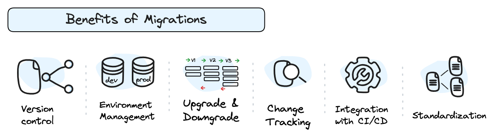
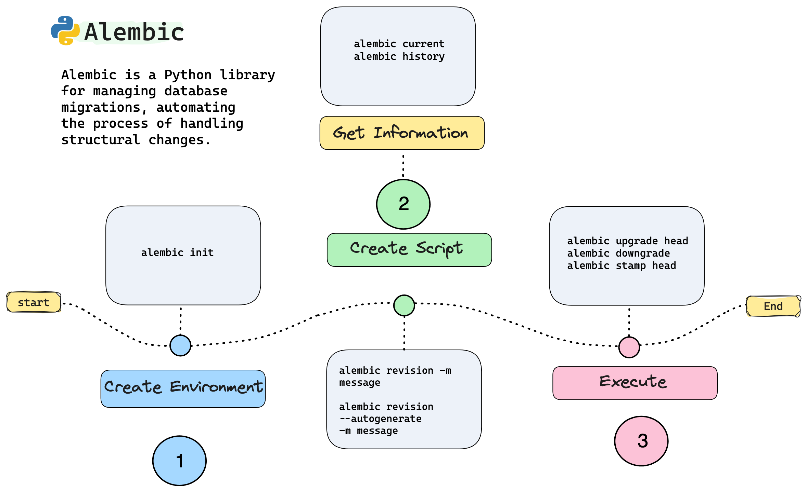

# ⚙️ Database-migration: Alembic Tutorial
Tutorial: How to Use Alembic in Python for database migration

---
 

## Table of Contents
You can find all the turotial in `alembic_tutorial.ipynb` python notebook with the explanations about the following points:

- 🔧 Database migrations
- 🔧 What is Alembic?
- 🔧 Prerequisites
- 🔧 Alembic: Configuration
- 🔧 Alembic: Create our first migration
- 🔍 What is Audit alembic?

 

-----

## 🔧 Database migrations
A migration is the process that allows you to modify the structure of the database, these migrations are created to maintain consistency and integrity.

 * ✅ **Version Control**: Avoids manual intervention in the database by maintaining control over schema versions.

* ✅ **Environment Management**: Facilitates the creation of new environments through the application of migrations, enabling easy reproduction of specific configurations and maintaining coherence between them.

* ✅ **Upgrade & Downgrade**: Another benefit is the ability not only to apply changes but also to revert them. This provides flexibility and security in database management.

* ✅ **Auditing**: Alembic-audit is another library that can be implemented to maintain a chronological record of changes made to the database, facilitating traceability.

* ✅ **CI/CD Integration**: Easily integrates into CI/CD pipelines to apply database changes automatically, streamlining and ensuring consistency in application deployment.

* ✅ **Standardization**: This implementation enables cleaner, structured, and coherent development for defining and applying changes to the database schema. By using templates, script reuse is promoted, ensuring efficient and consistent management of database changes.

## 🔧 What is Alembic?

**Alembic** is a 🐍Python library that enables controlled and automated database migrations. This library utilizes `SQLAlchemy`  and  it allows for the management of changes in the database schema through __scripts__, which describe the modifications and can be applied automatically.

---

---

